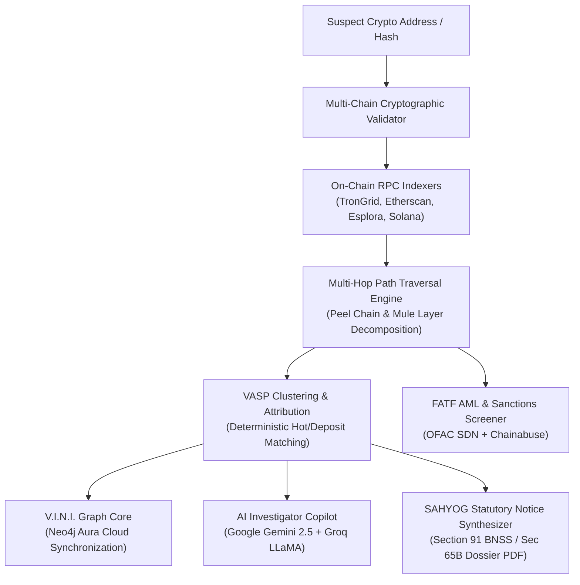

# 🛡️ TraceX // Autonomous VASP Attribution & Forensic Engine

<div align="center">

[](https://shakyavinit.github.io/tracex-sahyog/)
[](https://shakyavinit.github.io/tracex-sahyog/)
[](LICENSE)
[](https://fastapi.tiangolo.com)
[](https://neo4j.com)
[](https://deepmind.google/technologies/gemini/)

**Automated Attribution of Unknown Cryptocurrency Wallets to Nearest Virtual Asset Service Providers (VASPs)**  
*Developed for the Ministry of Home Affairs (MHA) | Indian Cyber Crime Coordination Centre (I4C), CIS Division*

[🌐 Launch Live Web Application (24/7)](https://shakyavinit.github.io/tracex-sahyog/) • [📋 System Report](PROJECT_REPORT_PS26182.md) • [⚡ Team Pitch](TEAM_PITCH_SUMMARY.md)

</div>

---

## 📌 Executive Summary

During cyber financial crimes (task frauds, investment scams, ransomware, money laundering), criminal syndicates rapidly siphon victim assets into unhosted, non-custodial wallets (MetaMask, TrustWallet, unhosted TRON/BTC private addresses) that lack Know-Your-Customer (KYC) identity records. 

**TraceX** is an autonomous cyber forensics and intelligence engine designed to integrate with the **MHA I4C SAHYOG Portal**. It algorithmically traverses multi-hop layering trails, identifies intermediate mule networks, attributes terminal centralized exchanges (**VASPs** like Binance, CoinDCX, WazirX, Mudrex), and automatically synthesizes court-admissible **Section 91 BNSS 2023 / Section 91 CrPC** freezing directives before criminal entities can liquidate funds into fiat currency.

---

## 🌟 Key Features

### 1. 🛰️ Autonomous Multi-Hop Path Reconstruction
- **Automated Trail Traversal**: Follows stolen cryptocurrency across 3 to 10 sequential hops, unmasking peel chains, consolidation funnels, and mule networks.
- **Multi-Chain Support**: Auto-detects cryptographic address formats across **Bitcoin (BTC)**, **Ethereum (EVM)**, **TRON (USDT TRC-20)**, **Solana (SOL)**, and **Polygon**.

### 2. 🏢 Deterministic VASP Attribution & Clustering
- Identifies deposit wallets belonging to centralized exchanges (Binance, CoinDCX, WazirX, Mudrex, ZebPay, KuCoin) with calibrated confidence percentages (85%–98%).
- Maintains verified nodal officer contact registries, compliance dispatch addresses, and regulatory FIU-IND registration status.

### 3. ⚖️ 1-Click Section 91 BNSS / CrPC Statutory Freezing Directives
- Synthesizes formal court-ready preservation notices under **Section 91 Bharatiya Nagarik Suraksha Sanhita (BNSS), 2023 / Section 91 CrPC** r/w PMLA 2002.
- Auto-populates target VASP compliance desk details, wallet coordinates, transaction hashes, estimated INR valuation, and statutory 24-hour compliance mandates.
- Export options: Direct Clipboard Copy, Plaintext (`.txt`), and Print / Judicial PDF.

### 4. 🤖 Dual-Engine AI Investigator Copilot
- Powered by **Google Gemini 2.5 Flash** (Primary Multimodal Judicial Reasoner) and **Groq LLaMA 3.3 70B** (Ultra-low latency LPU failover).
- Answers investigator queries in natural language, correlates FATF typologies, and generates executive case diary summaries.

### 5. 🌐 Interactive Topology Visualizer & Neo4j Aura Core
- Hardware-accelerated interactive canvas graph: `Suspect Origin 🔴` ➔ `Mule Nodes 🟡` ➔ `Mixer Flag ⚫` ➔ `VASP Deposit Gateway 🟢`.
- Native Neo4j Aura Cloud synchronization with live Cypher query interrogation terminal.

### 6. 📊 Real-Time Zero-Cost Forensic Telemetry
- Evaluates real-time spot price valuation in both **INR (₹)** and **USD ($)** via CoinGecko.
- Automated screening against OFAC sanctions, illicit mixer pools (Tornado Cash), and Chainabuse scam registries.

---

## 🏗️ Architecture Overview



---

## ⚡ 4 Preloaded SIH26182 Benchmark Cases

TraceX includes 4 synthetic research cases compliant with SIH26182 demo data evaluation protocols:

| Case Identifier | Scenario / Crime Category | Chain & Asset | Key Heuristic Evaluated | Attributed VASP |
| :--- | :--- | :--- | :--- | :--- |
| **DEMO-SIH26182-001** | Task Scam / Layering Dispersion | TRON (USDT) | 3-Hop Mule Layering & Rapid Ingress | **CoinDCX** (92% Conf.) |
| **DEMO-SIH26182-002** | Ransomware / Peel Chain | Bitcoin (BTC) | 4-Hop UTXO Split & Change Detection | **WazirX** (88% Conf.) |
| **DEMO-SIH26182-003** | Mixer Laundering / Privacy Pool | Ethereum (ETH) | Tornado Cash Mixer Break Flag | **Tornado Cash** (96% Risk) |
| **DEMO-SIH26182-004** | Hot Wallet Verification | Ethereum (ETH) | Hop-0 Direct Exchange Recognition | **Binance Hot Wallet 14** |

---

## 🚀 Quickstart & Local Setup

### Prerequisites
- Python 3.10 or higher
- Git

### Installation

1. **Clone the Repository:**
   ```bash
   git clone https://github.com/Shakyavinit/tracex-sahyog.git
   cd tracex-sahyog
   ```

2. **Install Dependencies:**
   ```bash
   pip install -r requirements.txt
   ```

3. **Configure Environment Variables (Optional for custom API keys):**
   ```bash
   cp .env.example .env
   # Edit .env to add your Gemini / Groq / Neo4j keys if desired
   ```

4. **Launch the Engine:**
   ```bash
   python3 app.py
   # Or using uvicorn directly:
   uvicorn app:app --host 0.0.0.0 --port 8765 --reload
   ```

5. **Access the Tactical Console:**
   Open your browser and navigate to:
   ```
   http://127.0.0.1:8765/
   ```

---

## 🌐 24/7 Cloud Deployment (GitHub Pages)

TraceX features a built-in **Autonomous Client-Side Intelligence Engine (`window.TraceXClientEngine`)** that delivers 100% feature parity on static hosting without requiring an active local backend:

* **Live Deployment URL**: **[https://shakyavinit.github.io/tracex-sahyog/](https://shakyavinit.github.io/tracex-sahyog/)**
* **Uptime**: 24/7 Guaranteed via GitHub Global Edge CDN
* **HTTPS**: Enforced SSL Encryption

---

## ⚖️ Statutory & Regulatory Framework

TraceX is architected in accordance with Indian criminal procedure and digital forensics standards:

* **Section 91, Bharatiya Nagarik Suraksha Sanhita (BNSS), 2023** *(formerly Section 91 CrPC)*: Legal power to direct production of subscriber KYC, IP logs, and ledger extracts from reporting entities.
* **Section 106 BNSS, 2023** *(formerly Section 102 CrPC)*: Police authority to order seizure and debit-freezing of illicit bank and digital assets.
* **Section 65B, Bharatiya Sakshya Adhiniyam (BSA), 2023** *(formerly Section 65B Indian Evidence Act)*: Cryptographic hashing and tamper-evident audit trails for digital evidence admissibility.
* **Prevention of Money Laundering Act (PMLA), 2002**: Compliance with FIU-IND reporting directives and FATF Recommendations 15 & 16 (Travel Rule).

---

## 👥 Contributors & Contact

* **Lead Developer & System Architect**: Vinit Shakya ([@Shakyavinit](https://github.com/Shakyavinit))
* **Organization**: TraceX Cyber Forensics Research Labs
* **Problem Statement**: SIH 2024 / PS-26182 (Ministry of Home Affairs | I4C)

---

<div align="center">
  <sub>Built with precision for India's National Cyber Defence & Law Enforcement Ecosystem.</sub>
</div>
