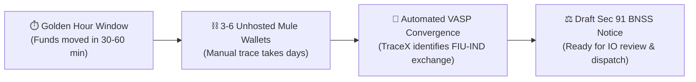
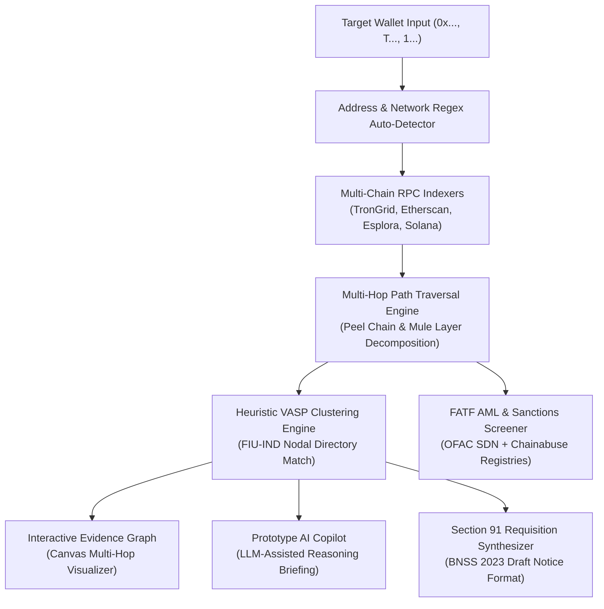

# 🛡️ TraceX Sahyog // Blockchain VASP Attribution & Forensic Engine

<div align="center">

[](https://shakyavinit.github.io/tracex-sahyog/)
[](https://shakyavinit.github.io/tracex-sahyog/)
[](https://shakyavinit.github.io/tracex-sahyog/)
[](https://fastapi.tiangolo.com)
[](https://neo4j.com)
[-f43f5e?style=for-the-badge&logo=googlegemini&logoColor=white)](https://deepmind.google/technologies/gemini/)

**Automated Attribution of Unknown Cryptocurrency Wallets to Nearest Virtual Asset Service Providers (VASPs)**  
*Research Prototype developed for Smart India Hackathon (Problem Statement ID: SIH26182)*  
*Aligned with Ministry of Home Affairs (MHA) | Indian Cyber Crime Coordination Centre (I4C) SAHYOG Specifications*

[🌐 Launch Live Prototype (24/7 Demo)](https://shakyavinit.github.io/tracex-sahyog/) • [📋 System Report](PROJECT_REPORT_PS26182.md) • [⚡ Team Pitch](TEAM_PITCH_SUMMARY.md)

</div>

---

> [!IMPORTANT]
> ### ⚠️ RESEARCH PROTOTYPE & DEMO DATA DISCLAIMER
> **Notice for Evaluators and Law Enforcement:**
> 1. **Research Prototype**: TraceX Sahyog is a research and evaluation prototype developed for Smart India Hackathon (PS-26182).
> 2. **Synthetic Demo Data**: All preloaded sample cases, wallet addresses, transaction hashes, and financial metrics are *synthetic benchmark simulations*. No real complainant, suspect KYC, or restricted police intelligence data is utilized.
> 3. **Probabilistic Heuristics**: On-chain attribution outputs and clustering scores represent *probabilistic leads* based on heuristic graph analysis, not absolute mathematical proof.
> 4. **Mandatory Human Sign-Off**: TraceX is strictly an *investigative decision-support system*. Any draft Section 91 notice, asset requisition, or judicial filing is subject to mandatory review, verification, and authorized dispatch by an accredited Investigating Officer (IO).

---

## 📌 Problem Context & Executive Summary

In cyber financial crimes (task-based scams, impersonation frauds, extortion, and ransomware), perpetrators rapidly disperse stolen victim funds across unhosted, non-custodial cryptocurrency wallets (e.g., MetaMask, TrustWallet, private TRON/BTC addresses) that carry no Know-Your-Customer (KYC) records.

**TraceX Sahyog** bridges the gap between raw blockchain explorer data and actionable statutory requisitions for Indian Law Enforcement Agencies (LEAs). It algorithmically traces multi-hop layering paths, isolates intermediary mule accounts, identifies where fund flows converge into regulated Virtual Asset Service Providers (VASPs such as CoinDCX, WazirX, Binance), and generates pre-formatted draft **Section 91 BNSS, 2023** (formerly Section 91 CrPC) preservation directives for authorized police review.

---

## 🏛️ Why This Matters for Law Enforcement Agencies (LEAs)



### 1. The "Golden Hour" Bottleneck in Crypto Investigations
When a cybercrime victim reports stolen cryptocurrency, the first 30 to 60 minutes are critical. Cybercrime syndicates systematically split and funnel funds through **3 to 6 unhosted mule wallets** within minutes. In manual investigations, an officer must navigate multiple fragmented public block explorers, paste transaction hashes into spreadsheets, and manually cross-reference deposit addresses—a process that typically consumes **48 to 72 hours**. By that time, the perpetrator has liquidated the cryptocurrency into fiat through P2P desks or moved it offshore. TraceX executes multi-hop graph traversal and identifies the recipient gateway in **under 5 seconds**.

### 2. Automated Convergence on Regulated VASPs
Unhosted wallets carry no verified identity. A suspect can only be apprehended or funds seized when the cryptocurrency touches a regulated **Virtual Asset Service Provider (VASP)**. In India, reporting entities registered with the Financial Intelligence Unit (FIU-IND) maintain verified KYC documents (Aadhaar, PAN, Video KYC), bank account details, phone numbers, and login IP address logs. TraceX's heuristic clustering isolates these regulated exchange deposit addresses from unhosted mule hops.

### 3. Rapid Statutory Requisition Generation (Section 91 BNSS)
Identifying the exchange is useless if the preservation requisition arrives after funds have been withdrawn. TraceX automatically pre-populates formal legal notice drafts under **Section 91 BNSS, 2023** with verified compliance nodal officer email addresses, exact transaction hashes, destination deposit addresses, and timestamped forensic evidence—allowing the Investigating Officer (IO) to immediately review, sign, and serve the order within the golden hour.

---

## 🔄 Grounded 6-Step Investigator Workflow

TraceX structures blockchain forensics into an intuitive, legally grounded 6-stage decision-support pipeline:

```
[1. Case Intake & Target Input]
       │
       ▼
[2. Blockchain Trace (Multi-Hop Graph Traversal)]
       │
       ▼
[3. Heuristic VASP Match (FIU-IND Registered Gateway)]
       │
       ▼
[4. Confidence Score (Calibrated Heuristic, e.g. 74% Medium-High)]
       │
       ▼
[5. Supporting Cryptographic Evidence & FATF Typology Tags]
       │
       ▼
[6. Mandatory Investigating Officer (IO) Review & Authorization]
```

1. **Step 01 — Case Intake**: Input suspect cryptocurrency address; automated regex detection identifies network (Bitcoin, Ethereum, TRON, Solana).
2. **Step 02 — Blockchain Trace**: Automated directed graph traversal follows fund flows across intermediary hops and peel chains.
3. **Step 03 — VASP Match**: Algorithmic clustering identifies the most probable regulated centralized exchange deposit gateway.
4. **Step 04 — Confidence Score**: Generates a calibrated probabilistic confidence rating (e.g., 74% Medium-High) with heuristic factor decomposition.
5. **Step 05 — Supporting Evidence**: Assembles cryptographic transaction hashes, chronological hop timestamps, and FATF AML red flag indicators.
6. **Step 06 — IO Approval Required**: Prepares the draft Section 91 BNSS requisition for mandatory review, verification, and formal sign-off by the human officer.

---

## 🌟 Core Features & Capabilities

### 1. 🛰️ Multi-Hop Path Reconstruction
- **Automated Trail Traversal**: Follows stolen cryptocurrency across 3 to 6 sequential hops, decomposing peel chains, consolidation funnels, and mule accounts.
- **Multi-Chain Coverage**: Supports **Bitcoin (BTC)**, **Ethereum / EVM (ETH)**, **TRON (USDT TRC-20)**, and **Solana (SOL)**.

### 2. 🏢 Probabilistic VASP Attribution & Clustering
- Correlates deposit addresses against known exchange hot wallet clusters (Binance, CoinDCX, WazirX, Mudrex, ZebPay) with calibrated confidence percentages.
- Maintains an updated directory of verified VASP nodal officer compliance emails and FIU-IND registration status.

### 3. ⚖️ Draft Section 91 BNSS Freezing Directives
- Synthesizes formal draft preservation directives under **Section 91 Bharatiya Nagarik Suraksha Sanhita (BNSS), 2023** (formerly Section 91 CrPC) read with PMLA 2002.
- Exports to clipboard, plaintext format (`.txt`), and judicial case diary format.

### 4. 🤖 Prototype AI Copilot (LLM-Assisted Reasoning)
- Integrated prototype forensic reasoning copilot utilizing multi-provider LLM inference (**Google Gemini** / **Groq LPU**) with rule-based fallback.
- Translates technical transaction graphs into plain-language case briefings and identifies FATF Red Flag typologies.

### 5. 🕸️ Interactive Evidence Graph
- Hardware-accelerated interactive canvas visualizer: `Suspect Origin 🔴` ➔ `Mule Nodes 🟡` ➔ `Mixer Flag ⚫` ➔ `VASP Deposit Gateway 🟢`.
- Visual inspection of flow directions, transaction amounts, and intermediary hops.

### 6. 📊 Grounded Forensic Telemetry (Synthetic Demo Mode)
- Spot price conversion in both **INR (₹)** and **USD ($)** via public price indices.
- Detection of known OFAC-sanctioned addresses and mixer interactions (e.g., Tornado Cash).
- All aggregated dashboard statistics are clearly marked as synthetic benchmark metrics for prototype evaluation.

---

## ⚠️ System Limitations & Grounded Technical Realities

To maintain scientific credibility and prevent false expectations, TraceX explicitly documents its operational boundaries:

| Limitation Area | Technical Reality & Operational Boundary | Mitigation / Investigator Requirement |
| :--- | :--- | :--- |
| **Probabilistic Attribution** | On-chain clustering heuristics identify the *most probable* exchange gateway. It does not constitute internal exchange ledger access. | Conclusive legal attribution requires formal confirmation from the recipient VASP via Section 91 notice. |
| **Upstream API Dependencies** | The prototype queries public and developer-tier RPC indexers (Etherscan, TronGrid, Esplora). High query volumes may encounter rate limits. | Production deployments require dedicated, sovereign MHA archival full-node clusters. |
| **Mixer & Cross-Chain Breaks** | Zero-knowledge mixing protocols (e.g., Tornado Cash) and cross-chain privacy bridges sever direct graph linkage. | TraceX flags the break as an AML typology alert rather than attempting false deterministic linkages. |
| **Human-in-the-Loop Protocol** | TraceX is a decision-support platform. It cannot autonomously freeze bank accounts or issue binding legal summons. | Strict requirement for human Investigating Officer (IO) review, verification, and authorized signature. |

---

## ⚡ 4 Preloaded Benchmark Cases (Synthetic Demo Mode)

TraceX includes 4 synthetic research cases designed to demonstrate distinct laundering typologies without compromising real victim data:

| Case Identifier | Typology / Scenario | Chain & Asset | Key Forensic Heuristic | Attributed VASP | Confidence Rating |
| :--- | :--- | :--- | :--- | :--- | :--- |
| **DEMO-SIH26182-001** | Task Scam / Layering Dispersion | TRON (USDT) | 3-Hop Mule Layering & Rapid Ingress | **CoinDCX** | 74% (Medium-High) |
| **DEMO-SIH26182-002** | Ransomware / Peel Chain | Bitcoin (BTC) | 4-Hop UTXO Split & Change Detection | **WazirX** | 76% (Medium-High) |
| **DEMO-SIH26182-003** | Mixer Laundering / Privacy Pool | Ethereum (ETH) | Tornado Cash Mixer Break Flag | **Tornado Cash** | 78% AML Risk Flag |
| **DEMO-SIH26182-004** | Hot Wallet Verification | Ethereum (ETH) | Hop-0 Direct Exchange Recognition | **Binance Hot Wallet** | Direct Label Match |

---

## 🏗️ Architecture & Component Stack



### Technology Stack
- **Frontend**: Lightweight vanilla JavaScript, CSS custom properties, canvas-based graph engine (Zero external bundle dependencies).
- **Backend API**: Python 3.11, FastAPI, Uvicorn, NetworkX (Graph Algorithms).
- **Inference Layer**: Multi-provider LLM integration (Google Gemini / Groq LPU) with rule-based deterministic fallback.
- **Client-Side Engine**: Autonomous offline engine (`TraceXClientEngine`) ensuring 24/7 demo uptime on static hosting (GitHub Pages).

---

## 🚀 Local Setup & Installation

### Prerequisites
- Python 3.10 or higher
- Git

### Steps

1. **Clone the Repository:**
   ```bash
   git clone https://github.com/Shakyavinit/tracex-sahyog.git
   cd tracex-sahyog
   ```

2. **Install Dependencies:**
   ```bash
   pip install -r requirements.txt
   ```

3. **Configure Environment (Optional):**
   ```bash
   cp .env.example .env
   # Add your optional Gemini / Groq / Etherscan API keys in .env
   ```

4. **Run the FastAPI Server:**
   ```bash
   python3 app.py
   # Or using uvicorn:
   uvicorn app:app --host 0.0.0.0 --port 8765 --reload
   ```

5. **Access the Application:**
   Open your browser and navigate to:
   ```
   http://127.0.0.1:8765/
   ```

---

## 🌐 24/7 Web Deployment (GitHub Pages)

The project includes an embedded client-side simulation engine that provides full interactive evaluation without requiring a local backend server:

* **Live Deployment URL**: **[https://shakyavinit.github.io/tracex-sahyog/](https://shakyavinit.github.io/tracex-sahyog/)**
* **Hosting**: GitHub Pages (Global CDN, HTTPS Enforced)
* **Mode**: Synthetic Demo Benchmark Mode active by default

---

## 📋 Pending Work & Production Roadmap

The following technical items represent planned enhancements for transition from research prototype to production pilot:

1. **Direct MHA SAHYOG Gateway API Integration**: Direct machine-to-machine dispatch of Section 91 notices via secure REST webhooks once official production API credentials are provided by I4C.
2. **Dedicated Sovereign Archival Nodes**: Provisioning dedicated on-premise full nodes for Bitcoin, Ethereum, and TRON networks to eliminate third-party API dependencies.
3. **Section 65B BSA Cryptographic Certificate Generation**: Automated generation of digitally signed Section 65B Bharatiya Sakshya Adhiniyam certificates with PKI / token-based cryptographic signing.
4. **Enhanced Cross-Chain Bridge Heuristics**: Deep taint-tracking integration for decentralized liquidity protocols (e.g., Thorchain, Stargate).

---

## ⚖️ Statutory Legal References (Indian Law)

* **Section 91, Bharatiya Nagarik Suraksha Sanhita (BNSS), 2023** *(formerly Section 91 CrPC)*: Summons / order to produce documents or other things (subscriber KYC, transaction journals, IP audit logs).
* **Section 106, BNSS, 2023** *(formerly Section 102 CrPC)*: Power of police officer to seize certain property (debit freeze of custodial digital assets).
* **Section 65B, Bharatiya Sakshya Adhiniyam (BSA), 2023** *(formerly Section 65B IEA)*: Admissibility of electronic records and tamper-evident audit trails.
* **Prevention of Money Laundering Act (PMLA), 2002**: Compliance obligations of reporting entities under FIU-IND and FATF Virtual Asset Guidance.

---

## 👥 Authors & Acknowledgments

* **Lead Developer & System Architect**: Vinit Shakya ([@Shakyavinit](https://github.com/Shakyavinit))
* **Project**: TraceX Sahyog
* **Hackathon**: Smart India Hackathon (SIH) | Problem Statement ID: 26182
* **Nodal Agency Alignment**: Indian Cyber Crime Coordination Centre (I4C), Ministry of Home Affairs (MHA)

---

<div align="center">
  <sub>TraceX Sahyog — Grounded Blockchain Intelligence for Law Enforcement Decision-Support.</sub>
</div>
