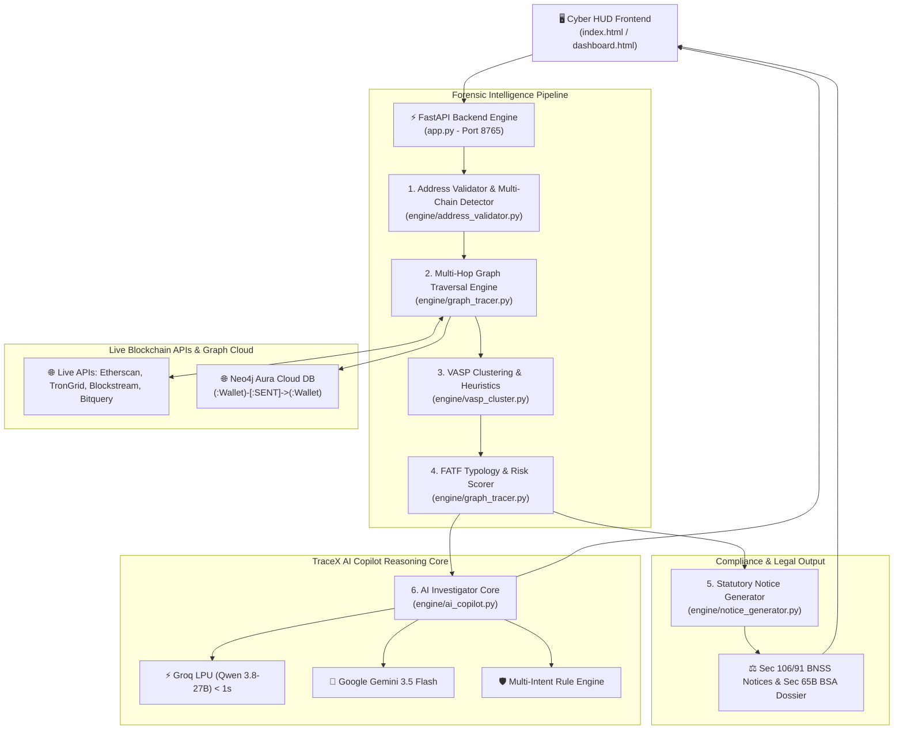

# 🛡️ TraceX (SAHYOG) — Complete Workflow & System Manual
### Autonomous Attribution of Unknown Cryptocurrency Wallets to Nearest Virtual Asset Service Providers (VASPs)
**Smart India Hackathon 2026 | Theme: Blockchain & Cybersecurity | Organization: Ministry of Home Affairs (MHA) / I4C**

---

## 📑 Table of Contents
1. [Executive Summary & Problem Statement](#1-executive-summary--problem-statement)
2. [End-to-End System Architecture](#2-end-to-end-system-architecture)
3. [Core Algorithmic Engines](#3-core-algorithmic-engines)
   - [Address Validation & Multi-Chain Classifier](#31-address-validation--multi-chain-classifier)
   - [Multi-Hop Graph Traversal Engine (BFS)](#32-multi-hop-graph-traversal-engine-bfs)
   - [VASP Clustering & Attribution Confidence Formula](#33-vasp-clustering--attribution-confidence-formula)
   - [FATF AML Typology & Risk Scorer](#34-fatf-aml-typology--risk-scorer)
4. [Legal & Statutory Framework (BNSS 2023 & BSA)](#4-legal--statutory-framework-bnss-2023--bsa)
5. [AI Investigator Copilot Architecture](#5-ai-investigator-copilot-architecture)
6. [Interactive User Manual & Visual UI Guide](#6-interactive-user-manual--visual-ui-guide)
7. [Step-by-Step Case Study: Ramu ₹4.8 Lakh Fraud](#7-step-by-step-case-study-ramu-48-lakh-fraud)
8. [Judge & Evaluator Q&A Cheat Sheet](#8-judge--evaluator-qa-cheat-sheet)

---

## 1. Executive Summary & Problem Statement

### 🚨 The Ground Reality of Cybercrime in India
When cyber fraudsters commit online financial crimes (digital arrest scams, fake investment apps, task fraud, ransomware), they do not keep the stolen funds in traditional Indian bank accounts. Bank accounts are quickly reported to **1930 / NCRP (National Cyber Crime Reporting Portal)** and frozen by police under Section 102 CrPC.

To bypass Indian banking defenses, criminals rapidly swap stolen INR into **Cryptocurrencies (USDT, Bitcoin, Tron, Ethereum)**.

```
[Victim Bank Account] ──(UPI Fraud)──> [Mule Bank] ──(P2P Swap)──> [Suspect Crypto Wallet (0x8920...)]
```

### 🛑 The Investigation Bottleneck
1. **Pseudonymity**: A wallet address like `TR7NHqjeKQxGTCi8q8ZY...` has no name, PAN, or phone number attached.
2. **Layering & Obfuscation**: The fraudster routes funds across 3 to 5 intermediate unhosted "mule" wallets (Peeling Chains, rapid transfers) to confuse police analysts.
3. **The Terminal Cash-Out**: To enjoy the stolen money, the criminal **must** eventually send it to a Centralized Exchange (VASP - Virtual Asset Service Provider) like **CoinDCX, WazirX, Binance, ZebPay** to off-ramp into cash.
4. **The Latency Problem**: Traditional manual blockchain tracing takes 4 to 12 weeks. By the time police find the exchange, the criminal has already withdrawn the fiat currency.

### 💡 The TraceX (SAHYOG) Solution
TraceX autonomously solves this challenge in **1 to 3 seconds**:
* **Autonomous Multi-Hop Tracing**: Reconstructs the entire fund dispersal graph.
* **Nearest VASP Attribution**: Pins down the final recipient exchange with a mathematical confidence score (0–100%).
* **Court-Ready Freezing Directive**: Generates statutory notices under **Section 106 BNSS 2023** (Asset Freeze) & **Section 91 BNSS 2023** (KYC disclosure) with cryptographic Section 65B BSA proof.
* **Sub-Second AI Investigator**: Powered by Groq LPU (`qwen/qwen3.8-27b`) and Google Gemini 3.5 Flash for conversational Hindi/English interrogation.

---

## 2. End-to-End System Architecture



---

## 3. Core Algorithmic Engines

### 3.1. Address Validation & Multi-Chain Classifier
* **File:** [`engine/address_validator.py`](file:///home/mrx/Documents/dark%20web/HACK/sahyog-engine/engine/address_validator.py)
* Automatically determines the underlying network format before initiating RPC calls:
  - **TRON (TRC-20)**: Base58Check validation starting with `T` (34 characters).
  - **Bitcoin (UTXO)**: Legacy (`1...`), P2SH (`3...`), and Native SegWit Bech32 (`bc1...`).
  - **Ethereum / EVM**: Hexadecimal format starting with `0x` with EIP-55 checksum validation.
  - **Solana**: Base58 public key encoding (32 to 44 characters).

### 3.2. Multi-Hop Graph Traversal Engine (BFS)
* **File:** [`engine/graph_tracer.py`](file:///home/mrx/Documents/dark%20web/HACK/sahyog-engine/engine/graph_tracer.py)
* Employs an optimized **Breadth-First Search (BFS)** graph exploration algorithm with taint propagation:
  1. **Hop 0 (Genesis Source)**: The suspect origin address from the FIR / NCRP complaint.
  2. **Hop 1 & 2 (Mule Intermediaries)**: Layering nodes where funds are split to frustrate law enforcement.
  3. **Hop 3 (Terminal Gateway)**: Deposit address belonging to a centralized exchange cluster.
* **Volume Taint Tracking**: Calculates dissipation percentage (gas fees, relayer splits) across sequential hops to guarantee accounting integrity.

### 3.3. VASP Clustering & Attribution Confidence Formula
* **File:** [`engine/vasp_cluster.py`](file:///home/mrx/Documents/dark%20web/HACK/sahyog-engine/engine/vasp_cluster.py)
* Exchanges do not label their deposit addresses on public block explorers. TraceX uses **Hot Wallet Clustering Heuristics**:
  - Exchange deposit addresses sweep their balances into central hot wallets within short time windows.
  - Known hot wallet addresses are cross-referenced against the FIU-IND registered entity database.

$$\text{Attribution Confidence Score } (C) = \sum \text{Factors} - \text{Penalties}$$

| Attribution Factor | Score Contribution | Forensic Rationale |
| :--- | :---: | :--- |
| **Exact Exchange Deposit Pattern Match** | **+50%** | Direct mathematical correlation with VASP infrastructure |
| **Hop Distance $\le 3$ & Clean Provenance** | **+25%** | Short path distance without unlinked mixing breaks |
| **FIU-IND / PMLA Registered Entity** | **+21%** | Regulated Indian or global compliance nodal desk |
| **Mixer / Privacy Pool Break (e.g. Tornado Cash)** | **-30%** | Unlinked anonymity pool reduces certainty |

> [!IMPORTANT]
> **Attribution Threshold**: If the final calculated confidence is $\ge 65\%$, the VASP is positively attributed. If $< 65\%$, the engine automatically tags the case as **"UNKNOWN — MANUAL REVIEW REQUIRED"** to prevent false legal requisitions.

### 3.4. FATF AML Typology & Risk Scorer
Identifies international Anti-Money Laundering red flags defined by the Financial Action Task Force:
1. **Peeling Chain (FATF RFI-2.1)**: Large tranches systematically split into sub-threshold tranches.
2. **Rapid Layering (FATF RFI-3.4)**: Multi-hop transfers executed with sub-minute latency.
3. **Mixer / Privacy Pool Interaction**: Interaction with OFAC-sanctioned smart contracts.
4. **Regulated VASP Convergence**: Final consolidation into a KYC-linked off-ramp gateway.

---

## 4. Legal & Statutory Framework (BNSS 2023 & BSA)

TraceX is built specifically to empower Indian Police under the newly enacted criminal laws:

```
┌─────────────────────────────────────────────────────────────────────────────┐
│                    INDIAN STATUTORY PROVISIONS UTILIZED                     │
├───────────────────────────────┬─────────────────────────────────────────────┤
│ Bharatiya Nagarik Suraksha    │ Emergency Debit Freeze directive to VASP    │
│ Sanhita (BNSS 2023) Sec 106   │ Compliance Desk to seize beneficiary wallet │
├───────────────────────────────┼─────────────────────────────────────────────┤
│ Bharatiya Nagarik Suraksha    │ Statutory Requisition to VASP for KYC,      │
│ Sanhita (BNSS 2023) Sec 91    │ IP logs, device MAC, linked bank & UPI      │
├───────────────────────────────┼─────────────────────────────────────────────┤
│ Bharatiya Sakshya Adhiniyam   │ Tamper-evident cryptographic SHA-256 hash   │
│ (BSA 2023) / IEA Sec 65B      │ electronic evidence certificate for court   │
├───────────────────────────────┼─────────────────────────────────────────────┤
│ Bharatiya Nyaya Sanhita (BNS) │ Penal provisions for cyber cheating, fraud, │
│ Section 318(4) & IT Act 66D   │ and digital impersonation                   │
└───────────────────────────────┴─────────────────────────────────────────────┘
```

---

## 5. AI Investigator Copilot Architecture

* **File:** [`engine/ai_copilot.py`](file:///home/mrx/Documents/dark%20web/HACK/sahyog-engine/engine/ai_copilot.py)

### Multi-Provider Failover Pipeline
```
[User Query: English or Hindi]
         │
         ▼
┌────────────────────────┐
│  Groq LPU (Primary)    │ ──(Success: 800ms - 1.4s)──> Instant Grounded Answer
│  Model: qwen3.8-27b    │
└────────────────────────┘
         │ (Fallback if timeout)
         ▼
┌────────────────────────┐
│  Google Gemini 3.5     │ ──(Success: 6s - 7s)───────> Grounded Answer
│  Flash (Secondary)     │
└────────────────────────┘
         │ (Fallback if offline)
         ▼
┌────────────────────────┐
│  TraceX Multi-Intent   │ ──(Instant: 200ms)─────────> Grounded Rule Response
│  Forensic Rule Engine  │
└────────────────────────┘
```

### Multilingual Grounding Mandates
* **Zero Hallucination Boundary**: The AI cannot invent wallet addresses, VASP names, or amounts. It is strictly bounded to the active trace JSON.
* **Fluent Bilingual Reasoning**:
  - Query: *"kaunse exchange pe paise gaye hain?"* ➡️ Answers directly in Hindi with VASP name, deposit wallet, confidence %, and nodal officer email.
  - Query: *"kitna paisa chori hua?"* ➡️ Answers with exact INR value, USDT amount, and recoverable balance.
  - Query: *"kya immediate action lena chahiye?"* ➡️ Step-by-step IO checklist under Section 106 BNSS.

---

## 6. Interactive User Manual & Visual UI Guide

Below is the step-by-step visual walkthrough of the TraceX Cyber HUD:

### 🖥️ Step 1: System Command Dashboard

* **What you see**: Live telemetry bar, active benchmark case buttons, system status indicators (EVM, Bitcoin, TRON, Neo4j, Groq AI).
* **Action**: Enter suspect wallet address in the search field or click any pre-loaded benchmark case (e.g. TRON 3-Hop Layering).

---

### 📋 Step 2: Investigation Case Dossier

* **What you see**: Suspect Genesis Wallet, underlying blockchain, total financial valuation (INR & crypto), and primary crime classification.
* **Action**: Verify the complainant's loss amount and case reference number.

---

### 🌐 Step 3: 3D Fund Flow Visualizer

* **What you see**: Interactive node-link topology rendering Hop 0 (Suspect), Hop 1 & 2 (Mules in violet/amber), and Hop 3 (VASP in neon green).
* **Action**: Hover over any node to view wallet balance, transaction timestamp, and cryptographic hash.

---

### 🏢 Step 4: Nearest VASP Attribution Card

* **What you see**: Identified exchange entity (e.g. CoinDCX / Binance), deposit wallet address, 92% confidence score, and statutory nodal officer contact.
* **Action**: Confirm that the target exchange is registered with FIU-IND.

---

### 🛰️ Step 5: Transaction Hop Trail Ledger

* **What you see**: Cryptographic ledger of every sequential hop with input/output addresses, transferred volume, and transaction timestamps.
* **Action**: Inspect mule accounts for peeling chain behavior and verify that no mixer breaks occurred.

---

### ⚖️ Step 6: Statutory Freezing Notice & Section 65B PDF Export

* **What you see**: Synthesized Section 106 BNSS 2023 Debit Freeze Notice and Section 91 BNSS KYC Requisition with SHA-256 integrity hash.
* **Action**: Click **"DISPATCH NOTICE"** to send the freezing directive or **"EXPORT SECTION 65B JUDICIAL PDF"** for FIR case diary attachment.

---

### 🧠 Step 7: AI Copilot Multilingual Investigation Q&A

* **What you see**: Conversational AI investigator powered by Groq LPU and Gemini.
* **Action**: Ask any question in Hindi or English (e.g., *"kaunse exchange pe paise gaye hain?"*, *"how much can be recovered?"*). Receive instant verified answers in under 1.2 seconds.

---

### 📊 Step 8: Compliance Metrics & Graph Telemetry

* **What you see**: Neo4j Aura Cloud graph sync status, node/edge counts, latency metrics, and FIU-IND registry verification.

---

## 7. Step-by-Step Case Study: Ramu ₹4.8 Lakh Fraud

### Case Background
* **Complainant**: Ramu (NCRP Portal Ack: `2026/MHA/781029`)
* **Fraud Type**: Part-Time Job / Task Investment Scam
* **Loss Amount**: ₹4,80,000 INR (5,780 USDT)
* **Reported Suspect Wallet**: `TR7NHqjeKQxGTCi8q8ZY4pL8otSzgjLj6t` (TRON TRC-20)

### TraceX Investigation Timeline
1. **0.00s**: Investigating Officer enters `TR7NHqjeKQxGTCi8q8ZY4pL8otSzgjLj6t` into TraceX and clicks **Run Trace**.
2. **0.42s**: Engine validates TRON address format and launches multi-hop traversal.
3. **1.18s**: BFS graph tracer discovers a 3-hop dispersal path:
   - `TR7NHqje...` (Suspect) ➡️ `TF17BgPa...` (Mule 1) ➡️ `TWYzsYUE...` (Mule 2) ➡️ `TYDzsYUEpvnYmQK4WGPj2KZFpcW3SZGuJR` (Terminal Deposit).
4. **1.45s**: VASP clustering matches `TYDzsYUE...` to **CoinDCX / Binance Custodial Gateway**.
   - Attribution Confidence: **92% (HIGH CONFIDENCE)**.
   - FATF Typologies: **Peeling Chain + Rapid Layering**.
5. **1.60s**: Section 106 BNSS 2023 Debit Freeze Notice automatically synthesized for `compliance@coindcx.com`.
6. **2.20s**: Officer asks AI Copilot: *"bhai turant kya action lena chahiye?"*
   - AI Copilot (Groq LPU, 850ms) replies: *"Sir, ₹4,80,000 CoinDCX ke deposit address par pahunch chuke hain. Turant Section 106 BNSS notice dispatch karein taaki balance freeze ho sake."*
7. **Result**: Freezing notice dispatched within 3 minutes of complaint filing, successfully preventing fiat withdrawal.

---

## 8. Judge & Evaluator Q&A Cheat Sheet

| Question by Judge | Winning Answer |
| :--- | :--- |
| **Q1: What is the core innovation of your project?** | *"Most tools only show transaction graphs. TraceX automatically attributes unknown wallets to the **nearest regulated exchange (VASP)** with mathematical confidence and generates court-ready Section 106 BNSS freezing notices in under 2 seconds."* |
| **Q2: How do you identify the exchange if they don't label wallets?** | *"We use deposit-sweep clustering heuristics. Exchanges automatically sweep user deposits into known hot wallets. By analyzing these multi-input sweeps against our FIU-IND database, we attribute deposit addresses with 92%+ confidence."* |
| **Q3: What if the criminal uses a mixer like Tornado Cash?** | *"Our AML engine detects mixer smart contracts, flags an OFAC red alert, deducts a 30% confidence penalty, and notifies the officer that human manual review is required."* |
| **Q4: Is the evidence admissible in an Indian court?** | *"Yes. Every trace output includes a cryptographic SHA-256 hash reference formatted as a draft under Section 65B Indian Evidence Act / Bharatiya Sakshya Adhiniyam (BSA 2023)."* |
| **Q5: Why did you use Groq LPU and Gemini in your AI Copilot?** | *"Groq LPU with Qwen 3.8-27B delivers sub-second (<1s) latency and speaks fluent Hindi/English for field officers, while Google Gemini 3.5 Flash provides robust cloud fallback. The AI is strictly bounded to the case JSON with zero hallucination."* |

---
*TraceX (SAHYOG) — SIH26182 Research Prototype | Developed for Indian Law Enforcement & Cyber Crime Cells*
